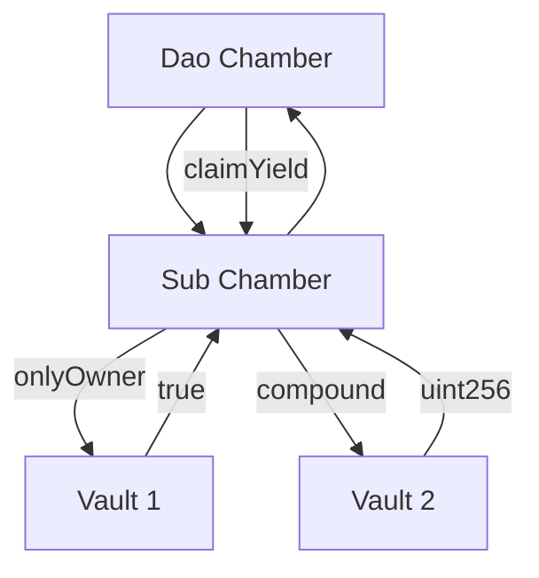

# Chamber Multisig


[](https://docs.loreum.org/blog)
[](https://github.com/loreum-org/chamber/LICENSE)

The Chamber is a multisig wallet that enables liquid democracy for Treasury and Protocol Management by the token community. Due to their composability, Chambers are a protocol governance standard that enables Access Control Roles to be controlled by token holders through representative leaders, rather than a core group of static founders. This enables decentralized ownership of DeFi protocols.
Chambers provide the functionality of a multisig wallet where signers are determined by delegation of ERC20 governance tokens.

The contract inherits upon instantiation existing ERC20 governance and ERC721 membership tokens. Delegations are made to ERC721 tokens which creates a leaderboard within the Chamber contract. The leaders are responsible for signing transactions and being the governors of the multisig. Each leader has a single vote that is not correlated to wallet balance, but rather by delegation of ERC20 governance tokens by the community against their NFT TokenId.

## Use Cases

1. **Protocol Admin Multisig**

The primary use cases for a chmaber contract is to be a protocol multisig wallet that owns the various roles and assets of a DAO or DeFi protocol. It's intended to be a drop-in replacement for the "Gnosis" Safe Multisig wallet.

2. **DeFi Composability**

Chambers are composable by inheriting any exisitng governance ERC20 token accross a number of Chambers and Sub Chambers. This horizontal and veritical composibility creates utility and intrinsic scarcity of DAO governance tokens.



3. **DAO Governance**

Chambers are meant to replicate the power dynamics of a modern company. The Chamber's governance system is a board with a specified number of seats. The board is controlled by Directors which are determined by token delegation. These Directors may then submit, confirm and execute transactions from the Chamber wallet.


Chambers use NFTs as membership tokens. Token delegation is done by allocating to an NFT tokenId, and a leaderboard of delegation balances is used to determine which NFTs are the Directors. NFTs are used to distinguish community members from sybil EOAs and function as  credentials to participate in the governance process.


Each Chamber is created with a designated number of seats and a quorum. If a member of the community removes their delegatation to a tokenId, that Director may lose their seat on the board and  ability to manage transactions. This creates a representative board of decision makers based on revocable authority by delegation.

### Setup

```
git submodule update --init --recursive
```

### Foundry

```
forge build
forge test
```